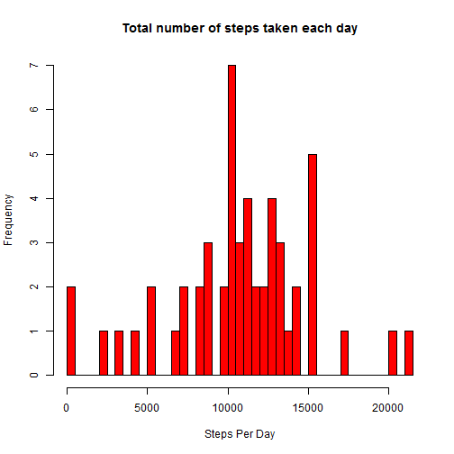
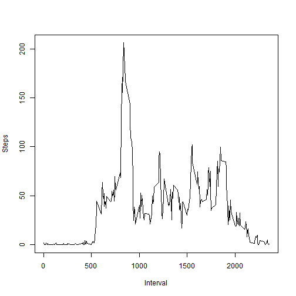
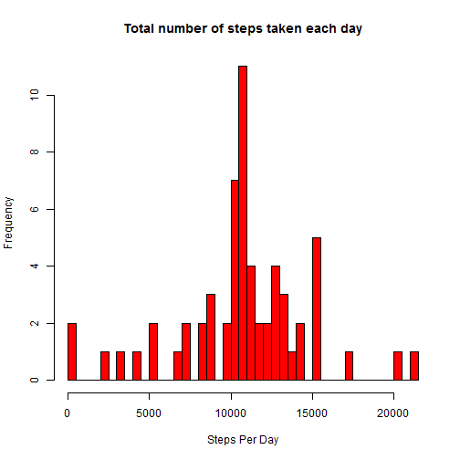
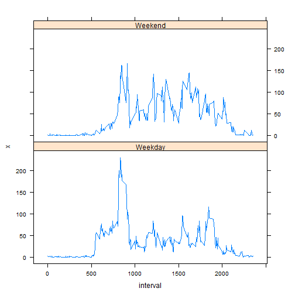

# Reproducible Research: Peer Assessment 1


## Loading and preprocessing the data

```r
 library(lattice)
 activity <- read.csv(".\\activity\\activity.csv")
 activityWithoutNA <- na.omit(activity)
```

## What is mean total number of steps taken per day?

```r
stepsPerDay <- aggregate(.~date, data=activityWithoutNA, FUN=sum, na.rm = TRUE)
hist(stepsPerDay$steps, breaks = nrow(stepsPerDay), col = "red", xlab="Steps Per Day", main = "Total number of steps taken each day")
```

 

```r
##meanOfSteps <- aggregate(.~date, data=activityWithoutNA, FUN=mean, na.rm = TRUE)
##medianOfSteps <- aggregate(.~date, data=activityWithoutNAandZeros, FUN=median, na.rm = TRUE)
mean(stepsPerDay$steps)
```

```
## [1] 10766
```

```r
median(stepsPerDay$steps)
```

```
## [1] 10765
```

## What is the average daily activity pattern?

```r
avgAcrossDays <- aggregate(.~interval, data=activityWithoutNA, FUN=mean, na.rm = TRUE)
plot(avgAcrossDays$interval, avgAcrossDays$steps, type = "l", xlab ="Interval", ylab = "Steps")
```

 

```r
oderdedDec <- avgAcrossDays[order(avgAcrossDays$steps, decreasing = TRUE),]
oderdedDec[1,1]
```

```
## [1] 835
```
## Imputing missing values

```r
#1
sum(is.na(activity))
```

```
## [1] 2304
```

```r
#2
meanPerInterval <- aggregate(.~interval, data=activity, FUN=mean, na.rm = TRUE)

#3
for (i in 1:nrow(activity) ) 
{
  if(is.na(activity[i,1]) == TRUE)
  {     
    interval <-  activity[i,3]
    val <- meanPerInterval[meanPerInterval[,"interval"]==interval,]   
    activity[i,1] <- ceiling(val$steps)
  } 
}

#4
stepsPerDay <- aggregate(.~date, data=activity, FUN=sum, na.rm = TRUE)

hist(stepsPerDay$steps, breaks = nrow(stepsPerDay), col = "red", xlab="Steps Per Day", main = "Total number of steps taken each day")
```

 

```r
##meanOfSteps <- aggregate(.~date, data=activityWithoutNA, FUN=mean, na.rm = TRUE)
##medianOfSteps <- aggregate(.~date, data=activityWithoutNAandZeros, FUN=median, na.rm = TRUE)
mean(stepsPerDay$steps)
```

```
## [1] 10785
```

```r
median(stepsPerDay$steps)
```

```
## [1] 10909
```
## Are there differences in activity patterns between weekdays and weekends?

```r
activity$day <- factor(ifelse(as.POSIXlt(activity$date)$wday %% 6 == 0, "Weekend", "Weekday"))


avgStepsPerDay <- aggregate(activity$steps, list(interval = activity$interval, day =activity$day), mean)


xyplot(x~interval|day, type = "l" ,data=avgStepsPerDay , layout = c(1,2)) 
```

 
